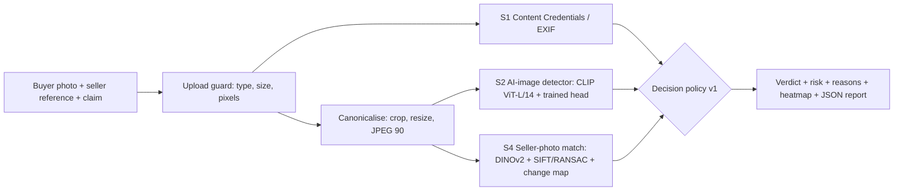

# Lenzit — Verify the claim, not just the pixels

**ForgeHacks 2026 · AI + Cybersecurity track**

A buyer can fake "damaged item" photos with a free AI editor in seconds and get a refund. Lenzit checks a refund claim's photo against the seller's reference photo. It returns a verdict (**likely genuine / needs verification / likely manipulated**), a risk score, a heatmap, and plain-language reasons, without punishing honest buyers whose items really arrived damaged.

- **Live demo:** https://raghavapuramharshith--lenzit-api-web.modal.run. Click a **preloaded case** (no upload needed) or check your own photo.
- **Video:** <YOUTUBE LINK>
- **Team:** Harshith Raghavapuram (ML, API, integration), Sriman (security, data)

> **Verification, not accusation.** "Needs verification" asks the buyer for a fresh photo. Lenzit never accuses anyone.

---

## Results (measured, not promised)

**Test set:** Lenzit-Bench v1, built from the public FraudBench dataset (CC BY-NC-SA 4.0) plus our scripted attacks.
- 200 products and 3,260 test rows.
- Every image tested as the original, stripped (metadata removed, JPEG 75), JPEG 50, and a phone-style screenshot.

**How we scored it:**
- Every number is **out-of-fold**: a product's photos are scored only by models that never saw that product.
- The operating point is **5% false alarms on real-damage photos**. That is the fairness constraint: honest buyers with real damage must pass.

| Setting (S2 AI-image detector) | Fakes caught at 5% false alarms on real damage | AUROC |
|---|---|---|
| Seen generators, original files | **70.2%** (95% CI 51–85%) | 0.926 |
| Seen generators, metadata stripped (JPEG 75) | **66.5%** (43–83%) | 0.914 |
| **Unseen generator** (leave-one-generator-out, average of 6) | **56.3%** (worst generator 31%) | 0.881 |
| Unseen generator, heavy JPEG 50 | 47.7% | 0.768 |
| Unseen generator, phone screenshot | 55.5% | 0.841 |

**Wrong-item check (T0, S4 reference):** the photo shows a different product than the seller's.

| Similarity threshold | Wrong-item photos caught | Genuine same-item photos flagged |
|---|---|---|
| 0.2 (deployed) | **83.3%** of 60 | 13.0% of 200 |
| 0.3 | 91.7% | 22.5% |

**Content Credentials (S1):** both untouched ChatGPT downloads we tested were flagged **likely manipulated** by the C2PA "AI-generated" declaration. One of them had passed the pixel detector (S2 score 0.01). That is why Lenzit layers signals.

**Frontier-model comparison:** <FILL: Gemini app on our 4 demo photos, X/4 correct vs Lenzit Y/4. State that it is 4 photos, not a benchmark.>

### Fairness checks we ran, and what they changed

- **Shortcut check:** file properties alone (format, JPEG quality) separate real from fake on FraudBench with AUROC 1.000. Every image therefore goes through one canonicalisation (crop, resize, JPEG 90), and the detector is trained on compression-matched fakes. Held-out recall was unchanged (62.0% to 62.1%), so the detector is not reading file format.
- **Fusion dropped:** a fused model looked better (78%), but S4 alone separates fakes from intact photos of the same products only at chance (AUROC 0.54), and S3 (TruFor) scored FraudBench's full-frame fakes below real photos (AUROC 0.39). The apparent gain was a dataset artefact, so we ship the honest S2-led policy instead.

---

## Try it in 30 seconds

Open the live demo and click the preloaded cases:

| Case | What happens | Why |
|---|---|---|
| Real damage, honest buyer | **Likely genuine** | Our own photo of a really dented bottle passes |
| ChatGPT fake (credentials intact) | **Likely manipulated** | The pixel detector scores it 0.01, but ChatGPT's Content Credentials declare AI generation |
| AI fake, metadata stripped | **Likely manipulated** | The pixel detector (S2) catches it with no metadata at all |
| Wrong item in the photo | **Needs verification** | The photo does not match the seller's reference |
| Known limitation | **Likely genuine** (missed) | The same ChatGPT fake as a screenshot: credentials gone, small edit. We show it on purpose |

## How it works



| Signal | What it checks | Status |
|---|---|---|
| **S1 Provenance** | C2PA Content Credentials ("AI-generated" / "AI-edited") and EXIF capture time vs delivery date | Live (hard rules) |
| **S2 Global AI-image detector** | Frozen CLIP ViT-L/14 features (5 crops) plus a linear head trained on FraudBench | Live (sets the risk score) |
| **S3 Local edit (TruFor)** | Localisation heatmap | Runs locally; off in the cloud; never moves the verdict |
| **S4 Reference consistency** | DINOv2 same-item similarity, SIFT+RANSAC alignment, change map vs the seller's photo | Live (wrong-item rule, heatmap) |
| S5 Plausibility (VLM) | Does the photo show the claimed damage? | Roadmap |

**Decision policy** (`models/decision_v1.json`, thresholds from out-of-fold scores):
1. The S2 score sets the risk.
2. **≥ 95th percentile** of real-damage scores → likely manipulated. **≥ 80th percentile** → needs verification.
3. A wrong item (S4) → at least needs verification.
4. C2PA "AI-generated" → likely manipulated (hard rule). C2PA "AI-edited", or a photo taken before delivery → at least needs verification.

**Stack:** FastAPI on Modal (CPU), PyTorch, open_clip, timm (DINOv2), OpenCV, scikit-learn. The UI is one HTML page served by the API.

---

## Security

- Uploads: JPEG, PNG, WebP or HEIC only, checked by magic bytes; at most 12 MB and 50 megapixels; Pillow decompression-bomb guard.
- Rate limit of 30 checks per hour per IP. No server-side URL fetching (no SSRF). Keys only in environment variables and Modal secrets, never in git.
- Threat model and red-team results: `docs/threat_model.md`, `docs/redteam_results.md`.

---

## What works and what doesn't

**Works**
- Catches about 2 in 3 AI-faked damage photos from known generators, and about 1 in 2 from a generator it never saw, while 95% of real-damage photos are never marked manipulated (about 80% pass outright; the rest are asked for a fresh photo).
- Our own real photos (an intact and a really dented bottle) both scored S2 0.00–0.01 and passed.
- ChatGPT downloads with Content Credentials are flagged even when the pixels look real.
- A wrong-item photo is caught 83% of the time.

**Doesn't work yet**
- **Small local AI edits with metadata stripped** (a screenshot of a ChatGPT edit) can pass. The pixel detector misses them, and the credentials are gone.
- 13% of genuine buyers whose photo looks very different from the seller's would be asked to verify.
- Lenzit does not check whether the photo actually shows the damage named in the claim (S5, roadmap).
- TruFor localisation is not measured on local inpainting; our G3/G4 attack sets were not finished.
- Buyer re-capture link (signed one-time camera capture) is designed but not built.

---

## Built during ForgeHacks (Oct 4–10, 2026)

- **Built by us:** canonicalisation, S2 head and evaluation (grouped CV, leave-one-generator-out, bootstrap), S4 reference check, FraudBench-derived benchmark, decision policy, API, UI, deployment, S1 and upload guard.
- **Pre-trained models:** OpenAI CLIP ViT-L/14 (MIT), DINOv2 (Apache-2.0), TruFor (research licence; not deployed).
- **Data:** FraudBench (CC BY-NC-SA 4.0, arXiv 2605.08820). The S2 head inherits the non-commercial licence and must be retrained before any commercial use.
- **AI coding tools:** Claude (planning and code assistance).

## Run locally

```bash
python3 -m venv .venv && source .venv/bin/activate
pip install -r requirements.txt
uvicorn serving.api:app --port 8000        # open http://localhost:8000
pytest -q
```

## Live end-to-end check (Oct 10, 15:50 IST)

20 photos with metadata stripped, sent to the public API exactly like the web page does (`scripts/live_check.py`):
10 of 10 AI fakes flagged (3 likely manipulated, 7 needs verification), 5 of 5 real-damage photos passed, and 3 of 5 intact photos passed (one detector false alarm, one wrong-item flag). Median latency was 8.9 s.
Abuse tests: text file renamed to .jpg was rejected (422), a 13 MB file was rejected (413), empty claim text was rejected (422), and the security headers and CSP are present.
**This is a functional check, not an accuracy result.** The deployed detector was trained on all of FraudBench, so these images are not unseen by it. Accuracy claims use only the out-of-fold numbers above.
